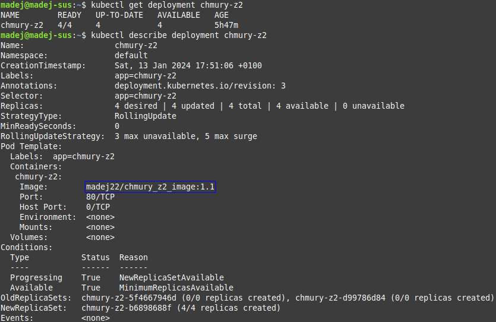
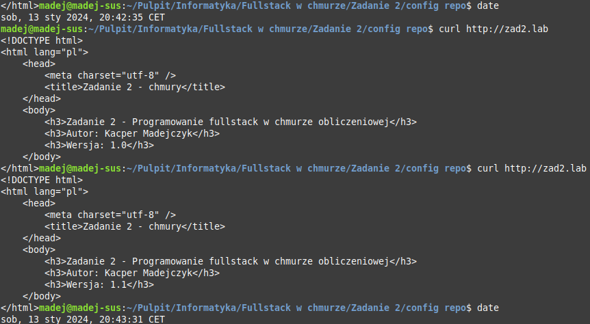
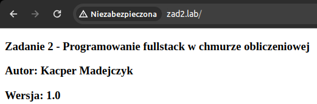
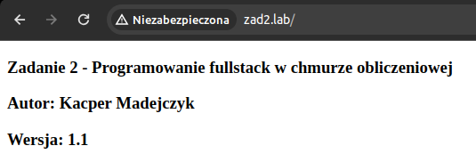

# Zadanie 2
## Programowanie Full-Stack w Chmurze Obliczeniowej
## Kacper Madejczyk, 92937

### Opis zawartości repozytorium
Repozytorium zawiera manifesty Kubernetes, przy pomocy których można uruchomić aplikację z [drugiego repozytorium](https://github.com/madej22/source_repo_chmury) w środowisku chmurowym.

Aby uruchomić aplikację w środowisku chmurowym, należy wykonać następujące polecenia:
```
minikube start
kubectl apply -f deployment.yaml
kubectl apply -f service.yaml
kubectl apply -f ingress.yaml
kubectl apply -f operator.yaml
```

Do sprawdzenia poprawności działania aplikacji wykorzystano następujące polecenia:
```
kubectl get deployment chmury-z2
kubectl describe deployment chmury-z2
curl http://zad2.lab
```

Efekty sprawdzenia poprawności deploymentu aplikacji (polecenia wykonano już po aktualizacji obrazu):


Sprawdzenie aplikacji przed i po aktualizacji (dokonano jej przez zmienienie zmiennej środowiskowej `APPVER` w [drugim repozytorium](https://github.com/madej22/source_repo_chmury) i uruchomienie łańcucha zadań GitHub Actions):




